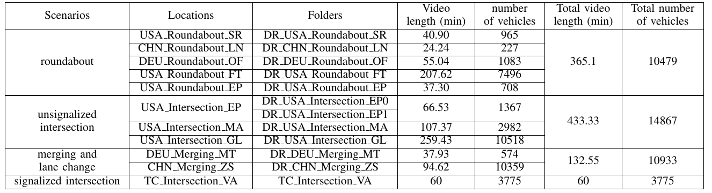

# INTERACTION Dataset Format

[TOC]

## Summary of the Dataset

The INTERACTION dataset provides 4 different kinds of interactive driving scenarios: roundabout, un-signalized intersection, signalized intersection, merging and lane changing. In total, we have collected data from 11 locations using drones or fixed cameras. 12 folders are included in the released "recorded_trackfiles" folder. Folders with \"DR\_\" are track files recorded via drones and folders with \"TC\_\" are trackfiles recorded via fixed cameras. The summary of the data is listed in the following table.

## Included Materials
For the 11 recording locations, we include three files for each location:

* Image of the recording location (xxx.jpg)
* High definition (HD) map (xxx.osm)
* Recorded trackfiles (vehicle_tracks_xxx.csv)

We also have provided a visualization tool (in python) for the users to visualize the HD map and the tracks. You can find more information in the part of the "visualization tools".

## Recorded Trackfiles (vehicle/person_tracks_xxx.csv)

This file contains all time dependent values for each track. Information such as track id, vehicle types, vehicle sizes, current positions, current velocities, and orientations are included.

### Meta Information of the Trackfiles

**track_id**: column 1. For each vehicle/person_tracks_xxx.csv file, the track_id starts from 1, and represent the ID of the agent.

**frame_id**: column 2. For each agent (per track_id), frame_id starts from 0, and represents the frames the agent appears in the video.

**timestamp_ms**: column 3. For each agent (per track_id), timestamp_ms from 0ms, and represents the time the agent appear in the video. The unit is ms.

**agent_type**: column 4. It represents the types of the tracked agent. For example, it can be a person, a car, a truck and so on.

**x**: column 5, the x position of the agent at each frame. The unit is m.

**y**: column 6, the y position of the agent at each frame. The unit is m.

**vx**: column 7, the velocity of the agent along x direction at each frame. The unit is m/s.

**vy**: column 8, the velocity of the agent along y direction at each frame. The unit is m/s.

**psi_rad**: column 9, the yaw angle of the agent at each frame. The unit is rad.

**length**: column 10, the length of the agent. The unit is m.

**width**: column 11, the width of the agent. The unit is m.

### Example

| track_id | frame_id | timestamp_ms | agent_type | x       | y        | vx     | vy    | psi_rad | length | width |
| :------: | :------: | :----------: | ---------- | ------- | -------- | ------ | ----- | ------- | ------ | ----- |
|    1     |    0     |      0       | car        | 999.101 | 1006.934 | -7.485 | 3.125 | 2.746   | 4      | 1.8   |
|    1     |    1     |     100      | car        | 999.354 | 1007.249 | -7.478 | 3.141 | 2.744   | 4      | 1.8   |

## Visualization Tools

We also have provided tools to visualize the tracks with the HD maps. The usage of the tools can be found in the [Visualization Tool Usage.md](https://github.com/interaction-dataset/interaction-dataset/blob/master/Visualization%20Tool%20Usage.md) file.

